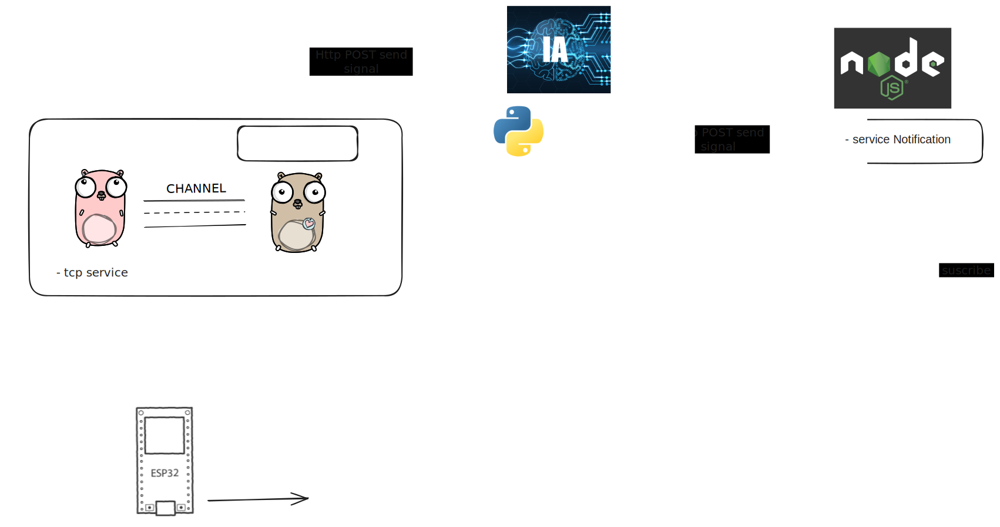

## HTTP - TCP services Go

#### Diagram:

## Requirements to run project
	
* [**Go programming language**](https://go.dev/doc/install)

## Run project

Execute project with next commands:
	
	$ go mod tidy
	$ go run .
